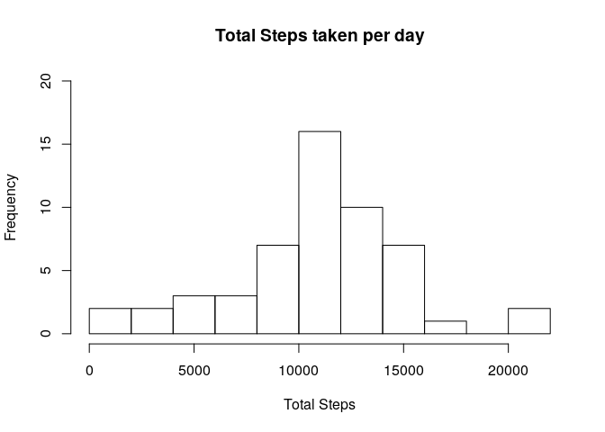
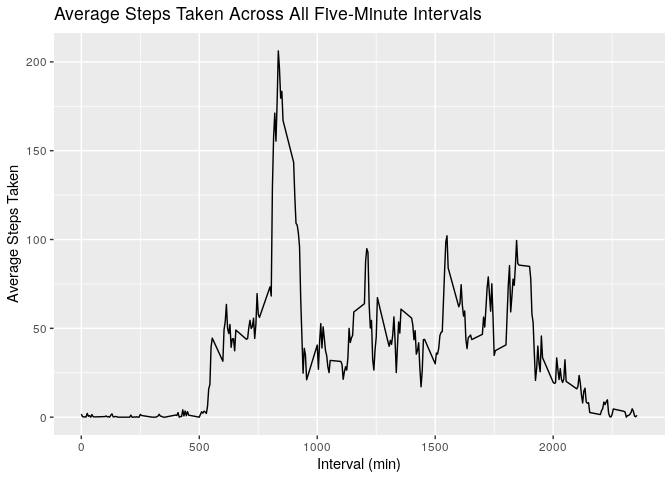
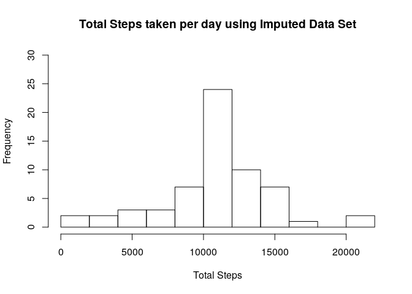
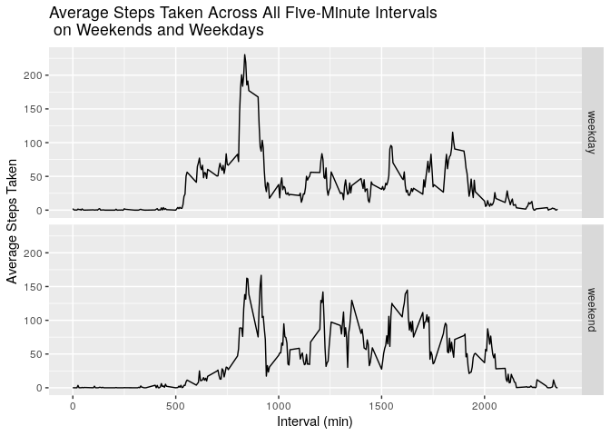

# Reproducible Research, Week 2, Course Project 1
Author: Charles N.

Date: June 13, 2020

This is the R Markdown document used to complete the first Course Project in the Reproducible Research Coursera course. It will contain all the necessary code and answers to complete the assignment

## Loading and preprocessing the data

First load in the ```tidyverse``` package since it contains other packages which will be used later on. Then read in the data table as a CSV, assigning it to the ```activity``` variable. Subset the ```activity``` data to remove any rows with missing values and assign the processed data to ```activityData``` variable. Then take a quick look at both data sets using the ```str``` and ```head``` functions.


```r
library(tidyverse)
```

```
## ── Attaching packages ──────────────────────────────────────────────────────────────────── tidyverse 1.3.0 ──
```

```
## ✓ ggplot2 3.3.0     ✓ purrr   0.3.3
## ✓ tibble  2.1.3     ✓ dplyr   0.8.5
## ✓ tidyr   1.0.2     ✓ stringr 1.4.0
## ✓ readr   1.3.1     ✓ forcats 0.5.0
```

```
## ── Conflicts ─────────────────────────────────────────────────────────────────────── tidyverse_conflicts() ──
## x dplyr::filter() masks stats::filter()
## x dplyr::lag()    masks stats::lag()
```

```r
activity <- read.csv('./repdata_data_activity/activity.csv', header = TRUE)

activityData <- activity[complete.cases(activity), ]

str(activity)
```

```
## 'data.frame':	17568 obs. of  3 variables:
##  $ steps   : int  NA NA NA NA NA NA NA NA NA NA ...
##  $ date    : Factor w/ 61 levels "2012-10-01","2012-10-02",..: 1 1 1 1 1 1 1 1 1 1 ...
##  $ interval: int  0 5 10 15 20 25 30 35 40 45 ...
```

```r
head(activity)
```

```
##   steps       date interval
## 1    NA 2012-10-01        0
## 2    NA 2012-10-01        5
## 3    NA 2012-10-01       10
## 4    NA 2012-10-01       15
## 5    NA 2012-10-01       20
## 6    NA 2012-10-01       25
```

```r
str(activityData)
```

```
## 'data.frame':	15264 obs. of  3 variables:
##  $ steps   : int  0 0 0 0 0 0 0 0 0 0 ...
##  $ date    : Factor w/ 61 levels "2012-10-01","2012-10-02",..: 2 2 2 2 2 2 2 2 2 2 ...
##  $ interval: int  0 5 10 15 20 25 30 35 40 45 ...
```

```r
head(activityData)
```

```
##     steps       date interval
## 289     0 2012-10-02        0
## 290     0 2012-10-02        5
## 291     0 2012-10-02       10
## 292     0 2012-10-02       15
## 293     0 2012-10-02       20
## 294     0 2012-10-02       25
```


## Question 1: What is mean total number of steps taken per day?

The objectives for this question are: 

1. Calculate the total number of steps taken per day
2. Make a histogram of the total number of steps taken each day
3. Calculate and report the mean and median of the total number of steps taken per day


```r
# Group the data by the date
activity.byDate <- group_by(activityData, date)

# Use summarize function to calculate the total steps taken for each day
activity.Steps <- summarize(activity.byDate, total.steps = sum(steps, na.rm = TRUE))

head(activity.Steps)
```

```
## # A tibble: 6 x 2
##   date       total.steps
##   <fct>            <int>
## 1 2012-10-02         126
## 2 2012-10-03       11352
## 3 2012-10-04       12116
## 4 2012-10-05       13294
## 5 2012-10-06       15420
## 6 2012-10-07       11015
```

```r
# Plot the total steps for each day as a histogram
hist(activity.Steps$total.steps, xlab= 'Total Steps', main = 'Total Steps taken per day', breaks = 10, ylim = c(0,20))
```

<!-- -->

```r
# Calculate the mean for the total steps taken per day
mean(activity.Steps$total.steps)
```

```
## [1] 10766.19
```

```r
# Calculate the media for the total steps taken per day
median(activity.Steps$total.steps)
```

```
## [1] 10765
```

## Question 2: What is the average daily activity pattern?

The objectives for this question are: 

1. Make a time series plot (i.e. type = "l") of the 5-minute interval (x-axis) and the average number of steps taken, averaged across all days (y-axis)
2. Which 5-minute interval, on average across all the days in the dataset, contains the maximum number of steps?


```r
# Use the 'activityData' data since we do not want missing values in our analysis

# Group the data by interval
activity.byInt <- group_by(activityData, interval)

# Use summarize function to calculate the average steps taken across the days
activity.avgSteps <- summarize(activity.byInt, avg.steps = mean(steps, na.rm = TRUE))

head(activity.avgSteps)
```

```
## # A tibble: 6 x 2
##   interval avg.steps
##      <int>     <dbl>
## 1        0    1.72  
## 2        5    0.340 
## 3       10    0.132 
## 4       15    0.151 
## 5       20    0.0755
## 6       25    2.09
```

```r
# Plot the average number of steps for each day as a time series plot (ie, type = l = lines between data points)
TimeSeries <- ggplot(activity.avgSteps, aes(x = interval, y = avg.steps)) + geom_line() +
    ggtitle('Average Steps Taken Across All Five-Minute Intervals') +
    ylab('Average Steps Taken') +
    xlab('Interval (min)')
TimeSeries
```

<!-- -->

```r
# Calculate the maximum number of steps taken for each day
maxSteps <- max(activity.avgSteps$avg.steps)
maxSteps
```

```
## [1] 206.1698
```

```r
# Filter out the row where the avg.steps equals the maximum number of steps across all the days
filter(activity.avgSteps, activity.avgSteps$avg.steps == maxSteps)
```

```
## # A tibble: 1 x 2
##   interval avg.steps
##      <int>     <dbl>
## 1      835      206.
```

The interval which contains the maximum number of steps taken (206.2) is the 835th minute interval.

## Question 3: Imputing missing values

The objectives for this question are: 

1. Calculate and report the total number of missing values in the dataset (i.e. the total number of rows with NA)
2. Devise a strategy for filling in all of the missing values in the dataset. The strategy does not need to be sophisticated. For example, you could use the mean/median for that day, or the mean for that 5-minute interval, etc.
3. Create a new dataset that is equal to the original dataset but with the missing data filled in.
4. Make a histogram of the total number of steps taken each day
5. Calculate and report the mean and median total number of steps taken per day. Do these values differ from the estimates from the first part of the assignment? What is the impact of imputing missing data on the estimates of the total daily number of steps?

For this question the original ```activity``` data set will be used. *It will then be modified to change all 'NA' values to be the average value for the given interval where the 'NA' appears, and this new data set will be used to generate the plot and answer any remaining questions*


```r
# Calculate total number of rows that contain an 'NA' value
sum(is.na(activity$steps))
```

```
## [1] 2304
```

```r
# Merge the original 'activity' data set with the 'activity.avgSteps' data set by the interval column
merge.Activity <- merge(activity, activity.avgSteps, by ='interval')
head(merge.Activity)
```

```
##   interval steps       date avg.steps
## 1        0    NA 2012-10-01  1.716981
## 2        0     0 2012-11-23  1.716981
## 3        0     0 2012-10-28  1.716981
## 4        0     0 2012-11-06  1.716981
## 5        0     0 2012-11-24  1.716981
## 6        0     0 2012-11-15  1.716981
```

```r
tail(merge.Activity)
```

```
##       interval steps       date avg.steps
## 17563     2355     0 2012-10-16  1.075472
## 17564     2355     0 2012-10-07  1.075472
## 17565     2355     0 2012-10-25  1.075472
## 17566     2355     0 2012-11-03  1.075472
## 17567     2355    NA 2012-10-08  1.075472
## 17568     2355    NA 2012-11-30  1.075472
```

```r
# For every instance where 'steps' column showing an NA is TRUE, replace it with the value in the same row from the 'avg.steps' column
noNA.Activity <- merge.Activity
noNA.Activity$steps[is.na(noNA.Activity$steps)] <- noNA.Activity$avg.steps[is.na(noNA.Activity$steps)]

head(noNA.Activity)
```

```
##   interval    steps       date avg.steps
## 1        0 1.716981 2012-10-01  1.716981
## 2        0 0.000000 2012-11-23  1.716981
## 3        0 0.000000 2012-10-28  1.716981
## 4        0 0.000000 2012-11-06  1.716981
## 5        0 0.000000 2012-11-24  1.716981
## 6        0 0.000000 2012-11-15  1.716981
```

```r
tail(noNA.Activity)
```

```
##       interval    steps       date avg.steps
## 17563     2355 0.000000 2012-10-16  1.075472
## 17564     2355 0.000000 2012-10-07  1.075472
## 17565     2355 0.000000 2012-10-25  1.075472
## 17566     2355 0.000000 2012-11-03  1.075472
## 17567     2355 1.075472 2012-10-08  1.075472
## 17568     2355 1.075472 2012-11-30  1.075472
```

```r
# First group the imputed data without NAs by date then use summarize to calculate total steps each day
# Plot the total steps when no NAs are present as histogram

noNA.Act.Date <- group_by(noNA.Activity, date)
noNA.Act.Steps <- summarize(noNA.Act.Date, total.steps = sum(steps, na.rm = TRUE))
head(noNA.Act.Steps)
```

```
## # A tibble: 6 x 2
##   date       total.steps
##   <fct>            <dbl>
## 1 2012-10-01      10766.
## 2 2012-10-02        126 
## 3 2012-10-03      11352 
## 4 2012-10-04      12116 
## 5 2012-10-05      13294 
## 6 2012-10-06      15420
```

```r
hist(noNA.Act.Steps$total.steps, xlab= 'Total Steps', main = 'Total Steps taken per day using Imputed Data Set', breaks = 10, ylim = c(0,30))
```

<!-- -->

```r
# Calculate the mean for the total steps taken per day for the imputed data
imput.avg <- mean(noNA.Act.Steps$total.steps)

# Calculate the media for the total steps taken per day for the imputed data
imput.med <- median(noNA.Act.Steps$total.steps)

# Original mean and median from question 1 of assignment (copied from above)
question1.avg <- mean(activity.Steps$total.steps)
question1.med <- median(activity.Steps$total.steps)

# Compare imputed average to original
imput.avg
```

```
## [1] 10766.19
```

```r
question1.avg
```

```
## [1] 10766.19
```

```r
# Compare imputed median to original
imput.med
```

```
## [1] 10766.19
```

```r
question1.med
```

```
## [1] 10765
```

The imputed average and the original average for total steps across the dates remains the same even after all NA values were replaced with the average step count for each interval. 

The imputed median is greater than the original median value, and actually matches the average for the imputed data. 

## Question 4: Are there differences in activity patterns between weekdays and weekends?

For this part the weekdays() function may be of some help here. Use the dataset with the filled-in missing values for this part.

Qbjectives for this question are: 
    
  1. Create a new factor variable in the dataset with two levels – “weekday” and “weekend” indicating whether a given date is a weekday or weekend day.
  2. Make a panel plot containing a time series plot (i.e. type = "l") of the 5-minute interval (x-axis) and the average number of steps taken, averaged across all weekday days or weekend days (y-axis). See the README file in the GitHub repository to see an example of what this plot should look like using simulated data.
  

```r
# Use the 'noNA.Activity' data set for this section of analyses that contains the imputed NAs

# Change the 'date' column to a date class
noNA.Activity$date <- as.Date(noNA.Activity$date)

# Create a new column that tells whether the date is a weekday or on the weekend
noNA.Data.DayID <- mutate(noNA.Activity, weekdayID = weekdays(noNA.Activity$date))

# Identify what kind of day each is within the new column 'weekdayID'
noNA.Data.DayID$day.type <- ifelse(noNA.Data.DayID$weekdayID == 'Saturday' | noNA.Data.DayID$weekdayID == 'Sunday', 'weekend', 'weekday')

# Convert the 'day.type' column into a factor variable
noNA.Data.DayID$day.type <- as.factor(noNA.Data.DayID$day.type)
str(noNA.Data.DayID)
```

```
## 'data.frame':	17568 obs. of  6 variables:
##  $ interval : int  0 0 0 0 0 0 0 0 0 0 ...
##  $ steps    : num  1.72 0 0 0 0 ...
##  $ date     : Date, format: "2012-10-01" "2012-11-23" ...
##  $ avg.steps: num  1.72 1.72 1.72 1.72 1.72 ...
##  $ weekdayID: chr  "Monday" "Friday" "Sunday" "Tuesday" ...
##  $ day.type : Factor w/ 2 levels "weekday","weekend": 1 1 2 1 2 1 2 1 1 2 ...
```

```r
# Split the data set into two sets - one for weekday data, one for weekend data

weekend.Data <- noNA.Data.DayID[noNA.Data.DayID$day.type == 'weekend', ]
weekday.Data <- noNA.Data.DayID[noNA.Data.DayID$day.type == 'weekday', ]

# Group each data set by 'interval' then take the mean for the total steps (as in Question 2)

weekend.byInt <- group_by(weekend.Data, interval)
weekend.avgSteps <- summarize(weekend.byInt, avg.steps = mean(steps, na.rm = TRUE), day = 'weekend')

weekday.byInt <- group_by(weekday.Data, interval)
weekday.avgSteps <- summarize(weekday.byInt, avg.steps = mean(steps, na.rm = TRUE), day = 'weekday')

# Combine the two data sets into one
dayData.combine <- bind_rows(weekend.avgSteps, weekday.avgSteps)

# Plot the data for weekdays and weekends as separate time series plots
dayData.TimeSeries <- ggplot(dayData.combine, aes(x = interval, y = avg.steps)) +
  geom_line() +
  facet_grid(day~.) +
  ggtitle('Average Steps Taken Across All Five-Minute Intervals \n on Weekends and Weekdays') +
  ylab('Average Steps Taken') +
  xlab('Interval (min)')

dayData.TimeSeries
```

<!-- -->
